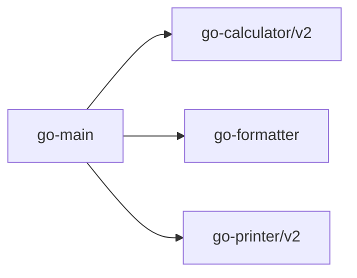

# chatgpt4generated-go-formatter

chatGPT4 generated _go-formatter_ module

One of the dependencies for: chatgpt4generated-_go-main_

part of the multi-module example

Dependency graph:

```mermaid
graph LR
A[go-main] --> B[go-calculator/v2]
A --> C[go-formatter]
A --> D[go-printer/v2]
```